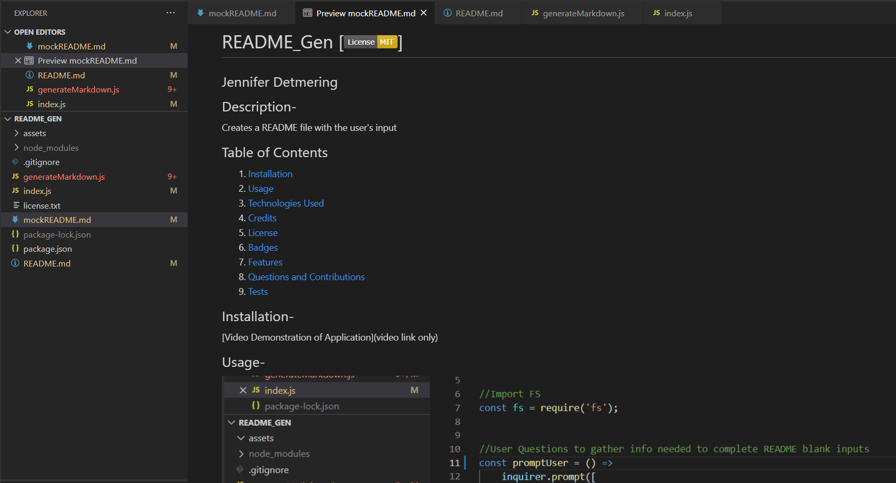

#  README_Gen []
## Jennifer Detmering
## Description-
An application that uses node.js and npm inquirer to prompt user for information to create an README file quickly with the user's input
        
## Table of Contents
1. [Installation](#installation)
2. [Usage](#usage)
3. [Technologies Used](#technologies_used)
4. [Credits](#credits)
5. [License](#license)
6. [Badges](#badges)
7. [Features](#features)
8. [Questions and Contributions](#questions_and_contributions)
9. [Tests](#tests)
        
##  Installation-

[Video Link](https:)
  

##  Usage- 

## Technologies Used-
JavaScript,  node.js,  npm file-system,  npm inquirer

## Credits-  
[W3 Schools](https://www.w3schools.com/js)
[GitHub](https://guides.github.com/features/mastering-markdown)

## License-
### MIT [MIT License](license.txt)

## Features-
Quickly creates a README with the user's input

## Questions and Contributions-  

### GitHub Profile: https://github.com/kodiakshuksan
### email: kodiakshuksan@yahoo.com

## Tests-  
none