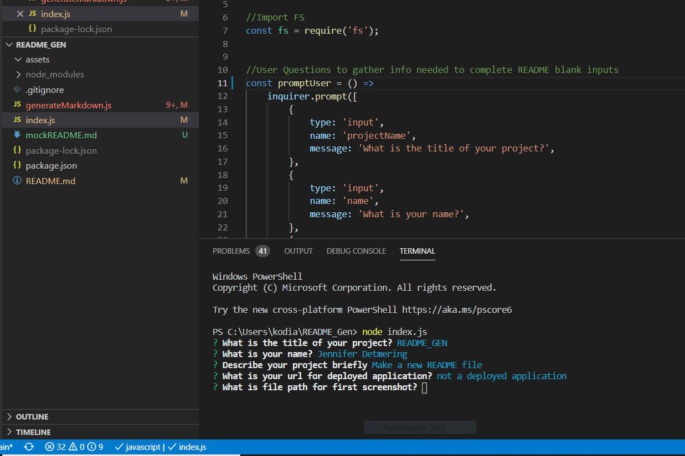

 #  README GEN 

## Jenny

## Description-
Makes a README file
## []   
## Table of Contents
1. [Installation](#installation)
2. [Usage](#usage)
3. [Technologies Used](#technologies_used)
4. [Credits](#credits)
5. [License](#license)
6. [Features](#features)
7. [Questions and Contributions](#questions_and_contributions)
8. [Tests](#tests)
        
##  Installation-

[Video Demonstration of Application](recording video now)
    
##  Usage- 

## Technologies Used-
npm

## Credits-  
[w3schools](https://www.w3schools.com/)

## License-
### [MIT License](license.txt)

## Features-
makes a README File

## Questions and Contributions-  

### GitHub Profile: https://github.com/kodiakshuksan
### Email: kodiakshuksan@yahoo.com

## Tests-  
none 